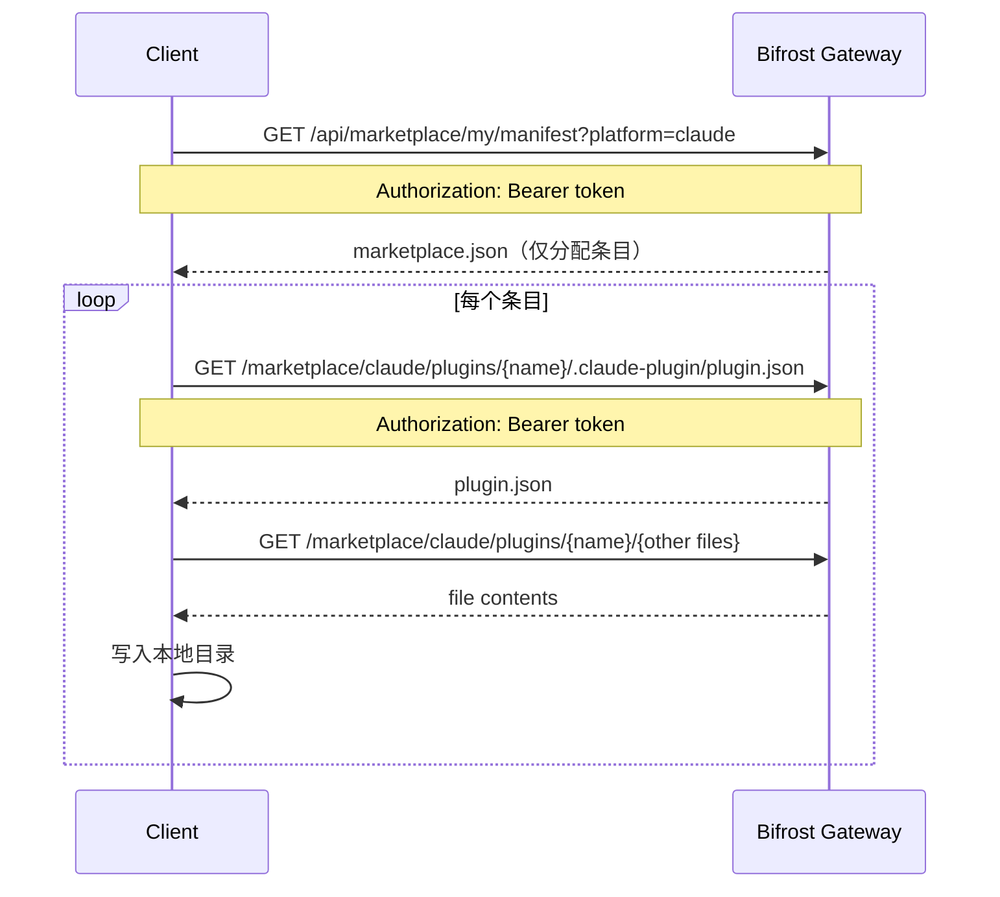

# Bifrost 应用市场 — 客户端对接指南

本文档说明 **Claude Code**、**Codex CLI** 及自研客户端如何从 Bifrost Gateway 获取市场清单（manifest），并将 **Skill / Plugin** 下载到本地。

---

## 1. 架构概览

```
┌─────────────────┐     ① 鉴权后获取 manifest   ┌──────────────────────────┐
│  Claude Code /  │ ─────────────────────────► │  Bifrost HTTP Gateway    │
│  Codex / 自研   │     ② 按 source 拉文件      │                          │
│  客户端         │ ◄────────────────────────── │  /api/marketplace/my/*   │
└─────────────────┘                            │  /marketplace/{platform}/│
        │                                      │    {type}/{name}/*       │
        │  ③ 写入本地目录                       └──────────────────────────┘
        ▼
  ~/.claude/ ...
  ~/.codex/ ...
```

Bifrost 将管理员导入的 Skill / Plugin 统一存储在 `marketplace_items` 表，并通过两类接口对外暴露：

| 类型 | 用途 |
|------|------|
| **Manifest 接口** | 返回 Claude / Codex 原生格式的 `marketplace.json`，供 CLI 或自研客户端安装 |
| **内容接口** | 按路径返回 `SKILL.md`、`.claude-plugin/plugin.json`、`.codex-plugin/plugin.json` 及 bundle 内其它文件 |

每个条目带有 **platform** 字段：`claude`（Claude Code）或 `codex`（Codex CLI）。Manifest 按平台拆分，互不混用。

**访问模型**：市场内容均为 **私有**。未登录用户无法访问；普通用户只能看到管理员 **分配** 给自己的条目；本地管理员不受条目分配限制。

---

## 2. 鉴权与用户可见范围

### 2.1 可见范围

| 角色 | 可见条目 |
|------|----------|
| 未登录 | 无 |
| 普通用户 | 管理员分配给该用户（或所属部门）的 `enabled=true` 条目 |
| 本地管理员 | 所有 `enabled=true` 条目 |

### 2.2 鉴权方式

请求需携带以下之一（Cookie 或 Header 均可）：

| 方式 | 示例 |
|------|------|
| Session Cookie | `Cookie: token=<session_token>` |
| Bearer Token | `Authorization: Bearer <session_token>` |
| 设备临时凭证 | `Authorization: Bearer bf-tmp-...` |

### 2.3 推荐接口

| 接口 | 说明 |
|------|------|
| `GET /api/marketplace/my/manifest?platform=claude\|codex` | 当前用户可见条目的 manifest |
| `GET /api/marketplace/my/items` | 当前用户可见条目 **含完整 content bundle**（适合自研客户端一次性同步） |
| `GET /api/marketplace/my/git-credentials` | 当前用户已配置的 Git 凭证状态（仅返回是否配置，不回显 token） |
| `PUT /api/marketplace/my/git-credentials` | 保存当前用户的 GitHub / GitLab token（导入 / 同步 Git 源时使用） |

> `my/git-credentials` 仅用于"以 Git 源导入"的场景，与 Skill / Plugin 下载无关；纯下载客户端无需调用。

---

## 3. 客户端接口清单

以下 `{BASE}` 表示 Gateway 根 URL，例如 `https://bifrost.example.com`。除管理端接口外，**所有客户端请求均需鉴权**。

### 3.1 Manifest（市场清单）

| 平台 | 路径 | 说明 |
|------|------|------|
| 用户级（推荐） | `GET {BASE}/api/marketplace/my/manifest?platform=claude` | 需鉴权，仅分配条目，Claude 格式 |
| 用户级（推荐） | `GET {BASE}/api/marketplace/my/manifest?platform=codex` | 需鉴权，仅分配条目，Codex 格式 |
| Claude Code 原生 | `GET {BASE}/.claude-plugin/marketplace.json` | 需鉴权，仅分配条目 |
| Codex 原生 | `GET {BASE}/.agents/plugins/marketplace.json` | 需鉴权，仅分配条目 |
| 通用 | `GET {BASE}/api/marketplace/manifest?platform=claude` | 需鉴权，仅分配条目 |
| 通用 | `GET {BASE}/api/marketplace/manifest?platform=codex` | 需鉴权，仅分配条目 |

`platform` 查询参数可选，默认 `claude`。

### 3.2 条目内容（按文件路径）

| 路径模式 | 说明 |
|----------|------|
| `GET {BASE}/marketplace/{platform}/{item_type}/{name}/{file...}` | **推荐**，含平台前缀 |
| `GET {BASE}/marketplace/{item_type}/{name}/{file...}` | 兼容旧路径，等价于 `platform=claude` |

参数说明：

- `{platform}`：`claude` 或 `codex`
- `{item_type}`：`plugins` 或 `skills`（推荐用复数；单数 `plugin` / `skill` 也兼容）
- `{name}`：条目名称，与 manifest 中 `name` 一致
- `{file...}`：bundle 内相对路径；省略时返回该条目默认入口文件

未登录、或条目未分配给当前用户时，内容接口返回 `401` / `403`。

> **检查顺序**：内容接口会**先校验条目是否存在、是否 `enabled`、类型是否匹配**（任一不满足返回 `404`），**之后才做鉴权**。因此对一个**不存在或已禁用**的条目，即使未携带 Token 也会先收到 `404`（而非 `401`）。鉴权失败的 `401` / `403` 仅在条目确实存在且启用时返回。
>
> **无目录列举接口**：本接口只能按确定路径取单个文件，**不提供** bundle 内文件清单。客户端需自行从 `plugin.json` / `SKILL.md` frontmatter 推断要下载哪些文件；若需可靠的全量文件列表，请改用 **方式 C**（`GET /api/marketplace/my/items` 返回的 `content.files`）。

**默认入口文件**

| 类型 | platform | 默认文件 |
|------|----------|----------|
| skill | 任意 | `SKILL.md` |
| plugin | claude | `.claude-plugin/plugin.json` |
| plugin | codex | `.codex-plugin/plugin.json` |

**示例**

```http
GET /marketplace/claude/skills/docs-helper/SKILL.md
Authorization: Bearer <token>

GET /marketplace/claude/plugins/data-toolkit/.claude-plugin/plugin.json
Authorization: Bearer <token>

GET /marketplace/codex/plugins/my-tool/.codex-plugin/plugin.json
Authorization: Bearer <token>
```

### 3.3 批量获取（自研客户端）

```http
GET /api/marketplace/my/items
Authorization: Bearer <token>
```

响应示例（字段为节选，实际还包含 `source_type`、`remote_url`、`remote_ref`、`category`、`tags`、`created_at`、`updated_at`）：

```json
{
  "count": 2,
  "items": [
    {
      "id": 1,
      "name": "docs-helper",
      "platform": "claude",
      "item_type": "skill",
      "description": "Documentation helper",
      "version": "1.0.0",
      "enabled": true,
      "icon_url": "/api/marketplace/items/1/icon",
      "content": {
        "skill_md": "---\nname: docs-helper\n---\n...",
        "files": {
          "references/guide.md": "..."
        }
      }
    }
  ]
}
```

`content` 字段结构：

| 字段 | 说明 |
|------|------|
| `plugin_json` | Plugin 的 manifest（Claude / Codex 共用存储） |
| `skill_md` | Skill 的 `SKILL.md` 全文 |
| `files` | 其它相对路径 → 文件内容（如 `agents/*.md`、`skills/*/SKILL.md`） |

### 3.4 图标

```http
GET /api/marketplace/items/{id}/icon
Authorization: Bearer <token>
```

返回上传的图标二进制，或 302 跳转到 `icon_url` 外链。仅对**已启用且已分配**给当前用户的条目可访问；条目不存在或已禁用返回 `404`，未分配返回 `403`。

---

## 4. Manifest 格式

### 4.1 Claude Code

```json
{
  "name": "bifrost-marketplace",
  "owner": {
    "name": "Bifrost",
    "email": "admin@example.com"
  },
  "plugins": [
    {
      "name": "data-toolkit",
      "source": "./marketplace/claude/plugins/data-toolkit",
      "description": "Data engineering plugin",
      "version": "1.0.0"
    },
    {
      "name": "docs-helper",
      "source": "./marketplace/claude/skills/docs-helper",
      "description": "Documentation skill",
      "version": "1.0.0"
    }
  ]
}
```

> Claude Code 将 Skill 与 Plugin 都放在 `plugins` 数组中，通过 `source` 路径区分（`skills/` vs `plugins/`）。

### 4.2 Codex

```json
{
  "name": "bifrost-marketplace",
  "interface": {
    "displayName": "Bifrost"
  },
  "plugins": [
    {
      "name": "my-tool",
      "displayName": "My Tool",
      "source": {
        "source": "local",
        "path": "./marketplace/codex/plugins/my-tool"
      },
      "policy": {
        "installation": "AVAILABLE",
        "authentication": "ON_INSTALL"
      },
      "category": "Plugins",
      "description": "Example Codex plugin"
    }
  ]
}
```

> Codex manifest 同样会输出 **Skill** 条目（`source.path` 形如 `./marketplace/codex/skills/{name}`）。Gateway 自动填充：`category` 缺省按类型取 `Plugins` / `Skills`；`displayName` 优先取 `plugin.json` 中 `interface.displayName`，否则用 `name`；`policy` 固定为 `installation=AVAILABLE`、`authentication=ON_INSTALL`。

---

## 5. Source 路径 → HTTP URL 映射

Manifest 中的 `source` 为 **相对于 Gateway 根目录** 的路径（以 `./` 开头）。

| Manifest source | 内容根 URL |
|-----------------|------------|
| `./marketplace/claude/plugins/{name}` | `{BASE}/marketplace/claude/plugins/{name}/` |
| `./marketplace/claude/skills/{name}` | `{BASE}/marketplace/claude/skills/{name}/` |
| `./marketplace/codex/plugins/{name}` | `{BASE}/marketplace/codex/plugins/{name}/` |
| `./marketplace/codex/skills/{name}` | `{BASE}/marketplace/codex/skills/{name}/` |

**映射规则（自研客户端）**

```
source = "./marketplace/claude/plugins/foo"
→ 去掉 leading "./"
→ content_base = {BASE}/marketplace/claude/plugins/foo/
→ 下载 plugin.json: {content_base}.claude-plugin/plugin.json
```

Codex manifest 中 `source.path` 同样遵循上述规则。所有内容请求均需携带有效 Token。

---

## 6. 下载 Skill / Plugin 到本地

### 6.1 方式 A：原生 CLI 接入

**Claude Code**

```bash
# 将 Bifrost 添加为市场源（Gateway 根 URL）
# 需确保 CLI 请求能携带有效 Session / Token
/plugin marketplace add https://bifrost.example.com

# 安装条目（@ 后为 manifest 中的 name 字段）
/plugin install data-toolkit@bifrost-marketplace
/plugin install docs-helper@bifrost-marketplace
```

Claude Code 会：

1. 拉取 `/.claude-plugin/marketplace.json`（仅含当前用户已分配条目）
2. 根据 `source` 路径下载 bundle 内文件
3. 安装到本地 plugin / skill 目录

**Codex CLI**

```bash
codex plugin marketplace add https://bifrost.example.com
codex plugin list --marketplace bifrost-marketplace
codex plugin install my-tool@bifrost-marketplace
```

Codex 会拉取 `/.agents/plugins/marketplace.json` 并按 `source.path` 安装。

> 若 CLI 无法自动携带 Gateway 登录态，请改用下方 **方式 C（批量 API）** 或 **方式 B（自研安装器）** 同步后再本地安装。

---

### 6.2 方式 B：Manifest + 逐文件 HTTP 拉取

适合自定义安装器、IDE 插件、CI 同步脚本。

**流程**

```
1. GET /api/marketplace/my/manifest?platform=claude|codex（带 Authorization）
2. 遍历 plugins[] 条目
3. 对每个条目：
   a. 解析 source → content_base URL
   b. GET 默认入口文件（plugin.json 或 SKILL.md）
   c. 解析 manifest / frontmatter，收集需下载的 files 列表
   d. 逐个 GET {content_base}{relative_path}（带 Authorization）
   e. 写入本地目录
```

**Skill 最小步骤**

```bash
BASE=https://bifrost.example.com
TOKEN=<session_token>
NAME=docs-helper

curl -sS "$BASE/marketplace/claude/skills/$NAME/SKILL.md" \
  -H "Authorization: Bearer $TOKEN" \
  -o "./skills/$NAME/SKILL.md"
```

**Plugin（Claude）最小步骤**

```bash
BASE=https://bifrost.example.com
TOKEN=<session_token>
NAME=data-toolkit

mkdir -p "./plugins/$NAME/.claude-plugin"
curl -sS "$BASE/marketplace/claude/plugins/$NAME/.claude-plugin/plugin.json" \
  -H "Authorization: Bearer $TOKEN" \
  -o "./plugins/$NAME/.claude-plugin/plugin.json"

# 若 plugin.json 或 bundle 中还有 agents/commands 等，继续拉取：
curl -sS "$BASE/marketplace/claude/plugins/$NAME/agents/analyst.md" \
  -H "Authorization: Bearer $TOKEN" \
  -o "./plugins/$NAME/agents/analyst.md"
```

**Plugin（Codex）最小步骤**

```bash
mkdir -p "./plugins/$NAME/.codex-plugin"
curl -sS "$BASE/marketplace/codex/plugins/$NAME/.codex-plugin/plugin.json" \
  -H "Authorization: Bearer $TOKEN" \
  -o "./plugins/$NAME/.codex-plugin/plugin.json"
```

---

### 6.3 方式 C：批量 API 一次同步（自研客户端推荐）

需要离线全量同步、或 CLI 无法透传鉴权时，优先使用：

```bash
curl -sS "$BASE/api/marketplace/my/items" \
  -H "Authorization: Bearer $TOKEN" \
  | jq .
```

**本地落盘伪代码**

```typescript
for (const item of response.items) {
  const root = item.platform === "codex"
    ? `./codex/${item.item_type}s/${item.name}`
    : `./claude/${item.item_type}s/${item.name}`;

  if (item.item_type === "skill" && item.content?.skill_md) {
    writeFile(`${root}/SKILL.md`, item.content.skill_md);
  }

  if (item.item_type === "plugin" && item.content?.plugin_json) {
    const manifestDir = item.platform === "codex"
      ? `${root}/.codex-plugin`
      : `${root}/.claude-plugin`;
    writeFile(`${manifestDir}/plugin.json`, JSON.stringify(item.content.plugin_json, null, 2));
  }

  for (const [relPath, body] of Object.entries(item.content?.files ?? {})) {
    writeFile(`${root}/${relPath}`, body);
  }
}
```

---

## 7. 建议本地目录结构

与 Bifrost manifest `source` 路径保持一致，便于 CLI 直接复用：

```
{install_root}/
├── marketplace/                    # 可选：镜像 HTTP 路径
│   ├── claude/
│   │   ├── plugins/{name}/
│   │   │   ├── .claude-plugin/plugin.json
│   │   │   ├── agents/
│   │   │   └── commands/
│   │   └── skills/{name}/
│   │       └── SKILL.md
│   └── codex/
│       ├── plugins/{name}/
│       │   ├── .codex-plugin/plugin.json
│       │   └── .mcp.json
│       └── skills/{name}/
│           └── SKILL.md
```

**Claude Code 默认安装位置**（参考）：`~/.claude/plugins/`、`~/.claude/skills/`  
**Codex 默认安装位置**（参考）：`~/.codex/plugins/`、repo 级 `.agents/plugins/`

---

## 8. 完整对接时序（自研客户端）



---

## 9. 错误码

| HTTP | 含义 |
|------|------|
| 200 | 成功 |
| 401 | 未登录 / Token 无效 |
| 403 | 条目未分配给当前用户 |
| 404 | 条目不存在、已禁用或文件路径不存在 |

---

## 10. 管理端接口（非客户端必需）

以下接口供 **管理员** 在 Web UI / 自动化运维中使用，普通 CLI 客户端无需调用：

| 方法 | 路径 | 说明 |
|------|------|------|
| GET | `/api/marketplace/items` | 分页列表 |
| POST | `/api/marketplace/items` | 占位接口，返回 `400` 引导改用 `import` |
| GET | `/api/marketplace/items/{id}` | 详情（含 content） |
| PUT | `/api/marketplace/items/{id}` | 更新条目元数据 / 分配 |
| DELETE | `/api/marketplace/items/{id}` | 删除条目及其分配 |
| POST | `/api/marketplace/items/import` | 导入 ZIP / GitHub / GitLab / 远程 catalog |
| POST | `/api/marketplace/items/{id}/sync` | 从远程源（github / gitlab / catalog）重新同步 |
| POST | `/api/marketplace/items/{id}/icon` | 上传条目图标 |
| GET | `/api/marketplace/catalog/presets` | 预置 catalog 源列表 |
| GET | `/api/marketplace/catalog/preview` | 预览远程 catalog 内容 |
| GET/PUT | `/api/marketplace/config` | 市场元数据（名称、owner、目录源等） |
| GET/PUT | `/api/marketplace/items/{id}/assignments` | 条目用户/部门分配 |
| GET/PUT/POST/DELETE | `/api/marketplace/users/{user_id}/assignments` | 用户条目分配（兼容） |

> `import` 的 `source_type` 支持 `zip`、`github`、`gitlab`、`catalog` 四种；仅 `github` / `gitlab` / `catalog` 条目可调用 `sync`。

---

## 11. 快速检查清单

- [ ] 未带 Token 访问 manifest / 内容接口应返回 `401`
- [ ] 已登录用户仅能看到分配给自己的条目（`GET /api/marketplace/my/manifest`）
- [ ] 已登录用户可通过 `GET /api/marketplace/my/items` 拉取完整 bundle
- [ ] 用 `GET /marketplace/claude/skills/{name}/SKILL.md`（带 Token）验证内容接口
- [ ] 未分配条目访问内容接口应返回 `403`
- [ ] Claude Code：`/plugin marketplace add {BASE}` 在携带有效登录态后能 list / install 已分配条目
- [ ] Codex：`codex plugin marketplace add {BASE}` 在携带有效登录态后能 list / install 已分配条目

---

## 12. 参考

- 内部设计概要：[`marketplace-design.md`](./marketplace-design.md)
- Claude Code Plugin Marketplaces：https://code.claude.com/docs/en/plugin-marketplaces
- Codex Plugin 构建：https://developers.openai.com/codex/plugins/build
